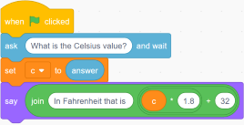

# CSE1110: Structured Programming 1

* Students are introduced to a general programming environment in which they write simple structured algorithms and programs that input, process and output data, use some of the more basic operators and data types, and follow a sequential flow of control.
* Prerequisite: None

## Option A

### Programming Challenges

These can be done in almost any programming language or environment. For example [Scratch](https://scratch.mit.edu/), [Python on Colab](https://colab.research.google.com), or [Makecode Arcade](https://arcade.makecode.com/).

1. Temperature Conversion
    * Task: design a program to convert Fahrenheit temperatures (input) to Celsius temperatures (output)
        * Celsius = (Fahrenheit - 32) / 1.8
    * 

2. Two-Number Calculator Program
    * Task: design a calculator that accepts two numbers and an operation (add, subtract, multiple, or divide)

3. Vowel Counter
    * Task: design a program that takes a string of characters as an input and counts how many vowels it contains
    * [Scratch video](https://www.youtube.com/watch?v=jRf_IeaQ5hs)

4. Simple Data Analysis
    * Task: design a program that takes a list of numbers and calculates the average, minimum, and maximum values

5. Game Creation
    * Task: create a game where scores (and high scores) are stored in a list
    * Examples: reaction timer, quiz buzzer, Pong

### Definitions

    * Task: create a slideshow or document with definitions for the following **as they relate to programming**:
        1. algorithm
        2. pseudocode
        3. source code
        4. IPO (input processing output)
        5. debugging
        6. IDE (integrated development environment)
        7. variable
        8. integer
        9. floating point number
        10. boolean
        11. string
        12. list

## Option B - Python and Data Science

Click [this Callysto link](https://hub.callysto.ca/jupyter/hub/user-redirect/git-pull?repo=https%3A%2F%2Fgithub.com%2Fcallysto%2Fcurriculum-notebooks&branch=master&subPath=TechnologyStudies/ComputingScience/Courses/structured-programming-1.ipynb&depth=1), log in with your Google (or Microsoft) account, and complete the activities and questions. If that doesn't work, use [this Colab link](https://colab.research.google.com/github/callysto/curriculum-notebooks/blob/master/TechnologyStudies/ComputingScience/Courses/structured-programming-1.ipynb).

Check that you have answered everything before you submit your **notebook**.

---

## Outcomes

The student will

1. demonstrate introductory structured programming skills by writing sequential algorithms to solve problems involving input, processing and output
    1. describe the purpose and nature of an algorithm
    2. analyze a variety of simple algorithms and describe the task or tasks the algorithms are attempting to carry out
    3. analyze problems and determine if they can be solved using algorithms that employ an input/processing/output (IPO) approach
    4. decompose the problem into its input, processing and output components, and identify what data is already available to the program and what must be inputted
    5. sequence components appropriately so that processing occurs only when all required data is available and output occurs only after appropriate processing has occurred
    6. write the algorithm in an acceptable format; e.g., pseudocode, structured chart
    7. test the algorithm for failure as well as success with appropriate data
    8. revise the algorithm, as required
2. translate algorithms into source code, convert the source code into machine executable form, execute and debug, as required
    1. describe a typical programming development environment commenting on the role of the key components; e.g., the source code editor, code translator (compiler and/or interpreter), executor, debugger
    2. compare and contrast integrated development environments specifically developed for programming with user assembled collections of applications and system software; e.g., text processor for coding, command line compiler
    3. describe and demonstrate the use of key components in a programming development environment
    4. convert algorithms into a sequence of statements in an appropriate programming language being sure to:
        1. maintain the IPO structure of the algorithm
        2. use appropriate internal and external documentation
        3. use appropriate data types such as integers, real numbers, characters and strings
        4. use appropriate variables and constants to hold data
        5. use literals and input commands, e.g., methods or operators, to provide data for processing
        6. use assignment, arithmetical and concatenation and interpolation operators, where appropriate, to process data
        7. use output commands; e.g., methods or operators, to display processed data
    5. test the algorithm for failure or success with appropriate data
    6. revise the algorithm, as required
3. analyze and compare the results of the program with the intent of the algorithm and modify as required
    1. use appropriate test data and debugging techniques to track and correct errors including:
        1. run-time errors; e.g., compiler, linker, syntax
        2. logic errors
4. demonstrate basic competencies
    1. demonstrate fundamental skills to:
        1. communicate
        2. manage information
        3. use numbers
        4. think and solve problems
    2. demonstrate personal management skills to:
        1. demonstrate positive attitudes and behaviours
        2. be responsible
        3. be adaptable
        4. learn continuously
        5. work safely
    3. demonstrate teamwork skills to:
        1. work with others
        2. participate in projects and tasks
5. make personal connections to the cluster content and processes to inform possible pathway choices
    1. complete/update a personal inventory; e.g., interests, values, beliefs, resources, prior learning and experiences
    2. create a connection between a personal inventory and occupational choices
